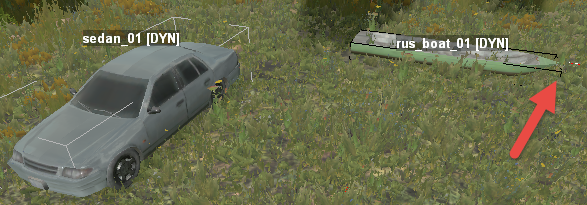
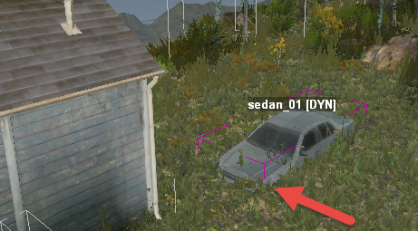
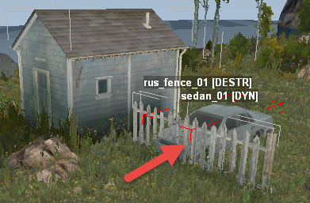

# Types of Models. Collisions

## Types of Models
There are three main types of models in the game basing on their properties:

1.  **Static** - these models do not move, they have no animations, they are not breakable. They do not participate in the physics of the game, except for the fact that they have collision meshes and the truck may collide with them.

2.  **Dynamic** - these models can be moved the truck and have collisions during this movement. They participate in the physics of the game. After an initial collision with the truck, they disappear from the map after a while (see below).

3.  **Destructible** - these models are dynamic models that can be broken by a truck into chunks. Both the remnants of the model and its chunks disappear from the map after a while (see below).

## Performance and Physics
For performance optimization purposes, the physics of the game works not at the level of the whole map, but only within its limited piece located around the current position of the truck. For the same purpose, dynamic and destructible models disappear from the map, when the period of their initial collisions with a truck is over and they are not nearby the truck.

The important moment here is that until the first collision, the physics for dynamic models is disabled and they will not disappear until they are moved and the truck leaves their area. After the first collision, the physics is enabled for them and they start to behave correspondingly. See [Custom_Level_Entities_Models_Overlays_and_PbrMaterials.pdf](./../../../custom_level_entities/Custom_Level_Entities_Models_Overlays_and_PbrMaterials.pdf) for details.

However, sometimes, this behavior of the dynamic model in the game is "bad".
For example, the piece of the fence, which is buried in deep snow, may try to jump up, when touched by a truck.

In most cases, this strange behavior is caused by the fact that this model is "buried" in the snow, mud, terrain or intersects with other static models (and starts to collide with them when the physics becomes enabled for it).

## Specific Features in Editor
To make the placement of models and plants correct from the point of view of the game physics and facilitate your work with models, the Editor has some specific features:

1.  **Types of all models and plants are visible in the Editor.**  
    For all models and plants the system displays their type of physical behavior (Collision Type) next to their labels:

    
    
    The "**STATIC**" value marks a static model, "**DYN**" -- a dynamic one, "**DESTR**" corresponds to a destructible dynamic model ("**DESTR+CHUNKS**" for plants corresponds to plants that are breakable into chunks). The same Collision Types are also displayed in the Asset Browser window when adding a plant or a model and in the properties of the model or a plant in the **Collision Type** field.

2.  **You can disable the physics for a dynamic model (and it will behave as a static one).**  
    You can make a dynamic or destructible model behave as a static one, i.e. disable all physics for it except the collisions. After that, the truck will be unable to move this model and this model will not disappear from the scene.
    To do this, enable the **Freeze Physics** option in the properties of this dynamic model.
    
    
    
    Dynamic models with the enabled **Freeze Physics** option are displayed with a **black** bbox around the model (instead of the regular grey one):

    

3.  **You can detect "bad" collisions of dynamic models directly in the Editor.**  
    If you enable the **Collision Notification** () option on the Toolbar of the Editor, the system will highlight all incorrect collisions of your dynamic models and manually added plants (i.e. *not* distributions) that occur when these models and plants intersect with other models, terrain, snow or mud.

    The bboxes of these incorrectly located models and plants will be:

    a.  **violet** -- if the dynamic model intersects with terrain, snow, or mud.
        

    b.  **red** -- if the dynamic model intersects with other models.
        

## Recommendations
Recommendations* on using different types of models are the following:

-   When you add models to the level, take into account their types. You should ***not*** use dynamic or destructible models in the areas where the space for them is insufficient, or where they intersect other models or terrain. Otherwise, you will get the buggy behavior of the physics in the game in this area.

-   If you want to use a dynamic model within the level ***only for its visuals*** (e.g. you are creating a static composition on the map that consists of multiple models), you should enable the **Freeze Physics** option for this model to make it static.

-   Check the intersections of your dynamic models with other models, terrain, snow, and mud. If you find these intersections, try to remove them: relocate the model, enable the **Freeze Physics** option, or simply remove the intersecting object.

