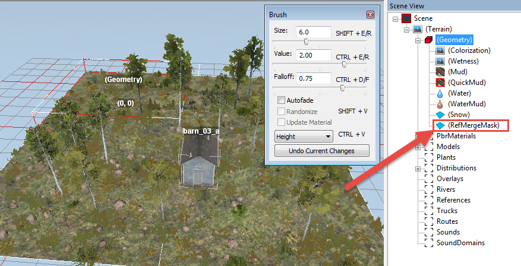
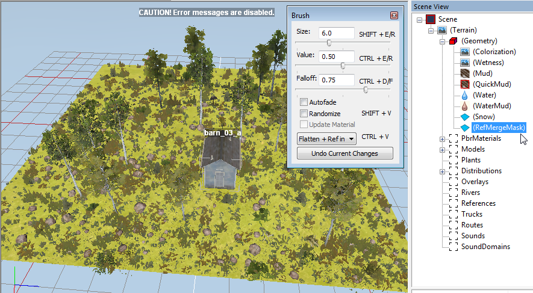
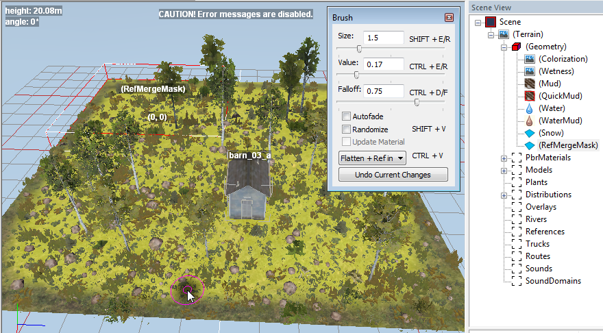

# RefMergeMask Brush

The **RefMergeMask** brush is used for references. It allows you to create a mask for merging a reference with your map. 

This mask will affect the merging of objects of the reference, its plants, materials, height with the corresponding properties of your map. 

The created mask is stored in the `_ref_merge.tga` texture. However, this mask will be used only if the **ApplyMergeMap** property of the reference is set to `True`.

Since it is used only for references, the **RefMergeMask** brush is hidden in the UI by default. To display it, do the following:

1.  Open the reference map in the Editor.

2.  Right-click the **Geometry** section in the **Scene View** panel.

3.  In the context menu, select **Create Ref Merge Map**.
    
    

4.  After doing this, the `_ref_merge.tga` texture will be created in the folder of the reference, and the **RefMergeMask** brush will be displayed in the **Geometry** section:

    

5.  Now you can select this brush and paint the mask for merging a reference with your map.

When you select this brush, the main window will display the initial merging mask of the reference:

This mask allows you to perform a smooth blending of the reference with the surrounding landscape, blending of the materials and plants.

The yellow color on the mask means that this area will be added to the map when this reference is imported to it. By default, the whole reference map has the same tone of yellow, i.e. – it is all added to the map.

Using the brush, you can specify areas that you do not want to add to the map (by removing yellow color from them) and the areas where the content of the reference and content of the map should be blended (the weight of the content from the reference in this blending is defined by the tone of yellow it has on the mask).

The **RefMergeMask** brush works similarly to all other brushes from the **Geometry** section: if the value selected in the **Value** slider is greater than `0.50`, the brush will add color to the mask; if it is less than `0.50`, the brush will remove color. Painting is performed by holding the right mouse button.

When painting the mask, you need to paint below objects located on the reference map and below the water.

Typically, the resulting mask should be similar to the picture below, where the mask gradually fades to the borders of the reference:

**NOTE**: This mask allows you to blend the [materials][materials] of the reference and the map. However, if layers of the materials are different then there will be a sharp difference in them on the borders of the terrain blocks of the map and the reference. To avoid that, you need to use the same base material in the reference and on the map. (Because of that, we recommend you to use only the base material on the edges of the reference.) Or, to avoid that you can use the appropriate [Mutator][mutator].

[materials]: ./../pbr_materials/assigning_pbr_materials_to_terrain.md
[mutator]: ./usage_of_mutators.md