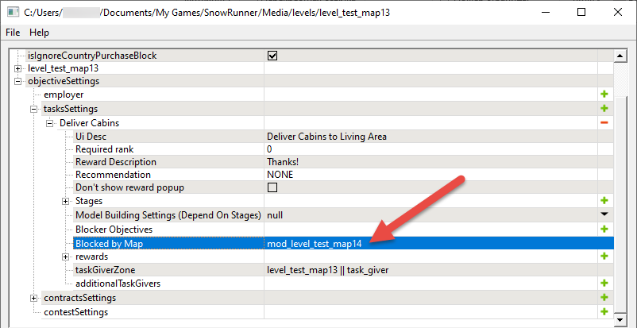

# Locking Objectives based on Exploration

*Currently, this topic is valid for SnowRunner only.*  
*In Expeditions, custom Regions with multiple interconnected maps are currently not supported. However, they are planned to be supported in the next versions of the game.*  

The **Blocked By Map** field in the settings of the objective allows you to lock or hide the objective until the player opens the particular map of the Region.

**WARNING**: The **Blocked By Map** field is also used for the very important purpose: the game cannot spawn cargo (using **spawnCargoOnStageActive**) on the map that does not exist in the Saved Game of the player and this field is used by the game to check that the target map is already explored (exists in the Saved Game).

I.e., if your Contract on the level of the Region spawns some cargo on the map, which needs to be specifically opened by the player (i.e., *not* the starting level), then you ***must*** specify the valid value of the **Blocked By Map** field pointing to this target map in the settings of this Contract. Otherwise, the game will generate an error upon opening this Region.

For Tasks, Contracts, and Contests on the level of the particular map, the **Blocked By Map** field is *not* used this way since, in this case, spawning can be performed only on this particular (already opened) map and the additional check of the map state is not necessary.

The **Blocked By Map** field can be specified both for Contracts on the level of the Region (in the Region Settings Editor, see the 1^st^ screenshot below) and for Tasks, Contracts, and Contests on the level of the particular map of the Region (in the Zone Settings Editor, see the 2^nd^ screenshot below).

*The Region Settings Editor dialog: **Blocked By Map** in the settings of a Contract on the level of the Region.*

*The Zone Settings Editor dialog: **Blocked By Map** in the settings of a Task on the level of the map.*

The value of this field is currently specified manually. The format you need to use to specify this field correctly is rather simple:

-   The "**mod\_**" prefix + **identifier of the target map**, which equals to the name of the XML file without the .xml extension.\
    The name of the map identifier typically starts with "**level\_**" according to our guidelines, so your value will probably be similar to:\
    **mod_level\_*my_level_name***

The behavior of an objective with a non-null value of the **Blocked By Map** field is the following:

-   **Contracts on the level of a Region** and **Contracts** of the particular map -- will appear locked to the player until he/she opens the specified target map. The information about that will be displayed on the navigation map in the descriptions of these contracts in the form of the "**Discover \<*name* of the map\>**" label.

**NOTE**: The *name* of the target map in this label is taken by the game from the **Id** field in the **Description level** section of the **Terrain** properties of the target map.

-   **Tasks** and **Contests** of the particular map -- will be hidden from the player totally until they open the specified target map. I.e., if the map from the **Blocked By Map** field is not opened, the player will not see the **taskGiverZone** zone of the Task/Contest and will be unable to activate it.

**NOTE**: If this field is specified for an objective on the level of the particular map, it will work for this objective even if you load this map separately (*not* as a part of the Region). Do not forget about that if you want to use one of the maps from the Region as a separate mod.

In your Regional Contract, if you spawn cargo on a map that is *not* the starting level, then you ***must*** specify the valid value of the **Blocked By Map** field pointing to this map, see the **WARNING** at the beginning of the section.

