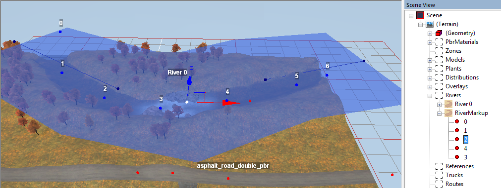

# Adding River Sounds via RiverMarkup

The river should not be silent in the game. To add sounds to the river, you can use the **RiverMarkup** tool.

Its principle is very simple - we create something similar to an overlay - the so-called "sound riverbed". And, we locate it so that it covers the riverbed of the river and its surroundings, roughly copying the shape of the river.

Inside the created "sound riverbed", the volume of the river sound will be at its maximum and the sound of the river will be played as 2D sound. When the player is moving away from the borders of the "sound riverbed", the sound volume will fade, and the 2D→3D panning will be performed. I.e, the 2D sound will be gradually transformed into 3D sound, so the player in this area will be able to understand by the river sound in what direction the river is located.

**NOTE**: As the sound of the river, the game will play the river sound from the sound preset, which is set in the **Ambient Preset** parameter of the **Terrain** object (see [Terrain Properties](./../terrain/terrain_properties.md)). If this parameter is not set, the river will be silent. If you want, you can create a custom **Ambient Preset**, see [Adding Ambient Sounds](./../sounds_and_music/ambient_sounds/adding_ambient_sounds.md).

To add a "sound riverbed" to the river, do the following:

1.  Right-click the **Rivers** section in the **Scene View** panel.

2.  In the appearing context menu, select **Add RiverMarkup**.

3.  Move the created **RiverMarkup** object to the river.

4.  Similarly to [Overlays](./../overlays/adding_overlays.md), add points to the curve of the **RiverMarkup** object by right-clicking the **RiverMarkup** object and selecting **Add Node**. Then, move these points on the map, positioning a curve of the **RiverMarkup** object along the riverbed.

    

5.  Each such point also has a **Width** parameter, which allows you to set the width of the **RiverMarkup** object at this point. You can use the mouse wheel to change the value of this field.

6.  Ensure that the **Ambient Preset** property of the **Terrain** object is set correctly (see [Terrain Properties](./../terrain/terrain_properties.md)).

