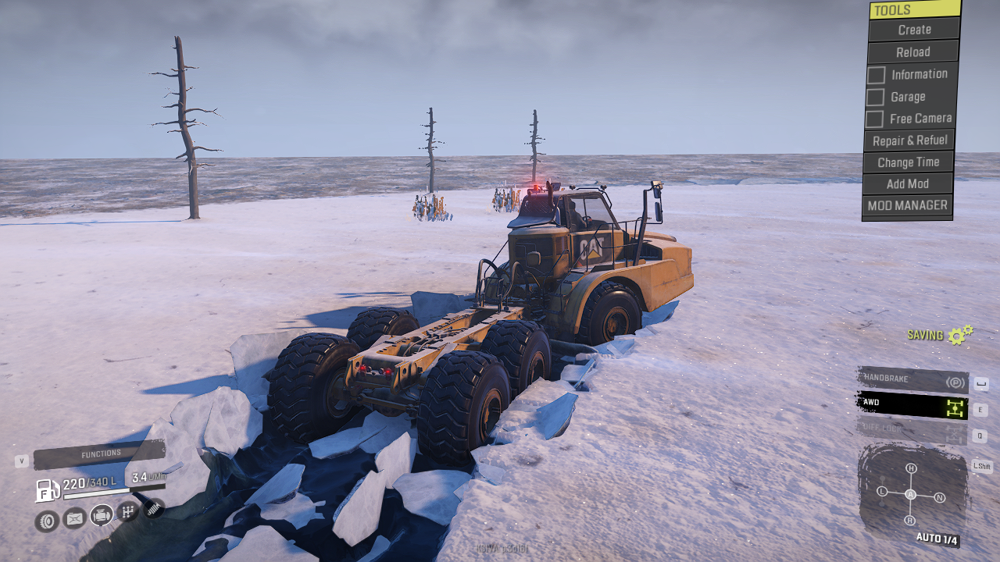
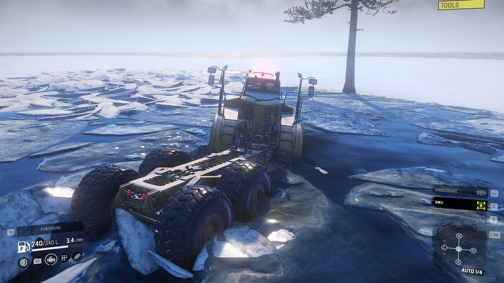

# Breakable Ice

*Currently, this feature is used in SnowRunner only.*

## Overview
On your winter maps, you can create areas of "breakable ice". 

These areas work as areas of deep mud, but a little bit differently: the player drives on the ice/snow surface, the ice becomes broken, the player's vehicle may get stuck in the mix of snow, ice, and water below the broken ice surface. 

**NOTE**: The player's vehicle will *not* go fully under the ice. However, the player will experience some difficulties due to broken ice and will see nice visuals.

Using this technique, you can create a frozen swamp:

Or, a shallow frozen river:

## Process

To create a breakable ice area:

1.  Ensure that your map has the correct **Extrudes To Wetness** value. In the [Terrain Properties][terrain_properties] of the map, the **Extrudes To Wetness** value should be equal to `1`.

2.  Create a PBR material with the `ice_02` texture as one of the layers. See [Material properties][material_properties] for details.  
    The recommended scheme of layers for the material is the following:

    a.  **Layer 1 (base layer)** - up to you.

    b.  **Layer 2** - the `ice_02` texture.

    c.  **Layer 3** - the `snow_layer` texture.

    d.  **Layer 4** - do *not* use.

3.  Paint the necessary area of the map with the `ice_02` layer of the material. We recommend you to use areas of flat terrain for that purpose.

4.  Paint the area from Step 3 above (the area with `ice_02`) with the [**Mud**][mud] brush in the **Extrudes** mode, with the **Value** = `1.0`.

5.  Create a [Distribution][distribution] based on the one the following brushes:

    -   `IceChunks` (for ice on a river)
    -   `IceDirt` (for ice over a swamp)

6.  Paint the area from Step 4 above (the area with `ice_02` and Extrudes) with the created Distribution, in the Density mode, with the **Value** = `0.80`.

7.  If you were painting with the `IceDirt` distribution (to create a frozen swamp), paint the snow (**snow_layer**) over the IceDirt area from Step #6, to cover the surface with snow.

8.  Create a [**River**][river] object and locate it directly below the terrain surface, to add water that will appear when the ice will be broken.

9.  *Optional:* If necessary, you can add the `ice_underwater_...` models below the river surface for prettier visuals.

    **NOTE**: A vehicle needs to be rather heavy to break the river ice, so use large trucks for debugging it.

[terrain_properties]: ./../terrain/terrain_properties.md 
[material_properties]: ./../pbr_materials/material_properties.md
[mud]: ./../terrain/geometry_brushes_for_terrain/mud.md
[distribution]: ./../distributions/adding_multiple_objects_via_distribution.md
[river]: ./../rivers_and_water_objects/adding_rivers_and_water_objects.md