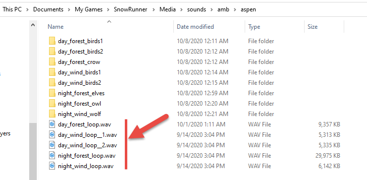

# Custom Ambient Sounds

## Overview
Follow the steps below to add custom ambient sounds to your map.

**NOTE**: To use custom ambient sounds, you will need to create a custom Ambient Preset as a separate XML file. See [Ambient Preset XML file][ambient_preset_xml_file] for details.

## Step 1: Prepare Files

First of all, prepare your files.

### Amount of Files
Typically, for a good preset, you need:

-   one *main loop* per every ["condition subpreset"][ambient_preset_xml_file] (e.g `<DayForest>`, `<DayWind>`, `<NightForest>`, and `<NightWind>`), i.e. four loops in total.

-   as many [`<RandomSet>`][ambient_preset_xml_file] sounds within each "condition subpreset" as you like. Typically, a [series of sounds][series_of_sounds] is used for every random set.

-   two sound loops for the river: one that will be played when the player is close to it and one to be played when the player is far from it.

**NOTE**: You can use single sound files or [sound series][series_of_sounds] for all these sounds.

### Format

Common parameters are `44.1 kHz`, `16 bit`, `.wav`, but there some differences:

-   Main loops of every "condition subpreset" should be `Stereo`.

-   `<RandomSet>` sounds should be `Mono`.

-   Sounds of the river should be `Mono` and looped.
             
**NOTE:** The volume level for ambient sounds and sounds of the river can vary greatly, you should tune it on a per-sound basis.

### Naming
Since there are really lots of files, you will probably want to use the naming convention of some sort. 

For example, you can start the names of main loops with the name of the condition subpreset. E.g., `day_wind_loop`.

If you use the [series of sounds][series_of_sounds], you need to follow their naming convention.

## Step 2: Put them in Hierarchy of Folders
Then, you need to put all these files into a hierarchy of directories with the `Media\sounds` folder as a root.

Typically, the process is the following (however, you can create your own hierarchy, if you want to):

1.  Create the `sounds` subfolder in the `Media` folder, if it is not created.

2.  In the `sounds` folder, create the `amb` subfolder, to separate all your ambient sounds from other sounds.

3.  In the `amb` folder, create the folder of your level. E.g. `aspen` for `level_aspen.xml`.

4.  Put the main loops in the folder of your level.  
    For example, for `level_aspen.xml` in *SnowRunner*:  

    

5.  If you use the [series of sounds][series_of_sounds] for random sets, create subfolders for them in the folder of the level, and put the sounds of random sets there.
    For example, for the same level in *SnowRunner*:  

    

6.  Put the sounds of the river somewhere in the hierarchy. For example, in the folder of the level, if they are specific, or straight into the `amb` folder if you plan to use them for multiple maps.

    

## Step 3: Create XML Class of Ambient Preset
Now, you need to create the XML class of the ambient preset somewhere in the `Media\classes\ambients\` folder:

1.  Create the XML class of the ambient preset, with all paths to your sound files (ensure that they are correct) and other settings.  
    For details, see [Ambient Preset XML file][ambient_preset_xml_file] in the same section.
    
    **NOTE**: The name of the preset file should not contain spaces and special symbols (except `_`). For example: `snd_amb_preset_aspen.xml`

2.  In the `Media` folder, create the `classes` subfolder, and, within it, the `ambients` folder.
3.  Put the XML of the preset there.  
    For example, for the same level:  

    

## Step 4: Modify Terrain Properties of Map
Open the Editor, open the necessary map, and specify the name of this preset in the **Ambient Preset** field of the [Terrain Properties][terrain_properties].

The name should be speicified without the file extension.

For example: `snd_amb_preset_aspen`

## Step 5: Pack Your Map
Finally, pack your map.

If you have done it all correctly, the `.pak` file of your map will now contain ambient sounds.

[series_of_sounds]: ./../sounds/series_of_sounds.md
[terrain_properties]: ./../../terrain/terrain_properties.md
[ambient_preset_xml_file]: ./ambient_preset_xml_file.md