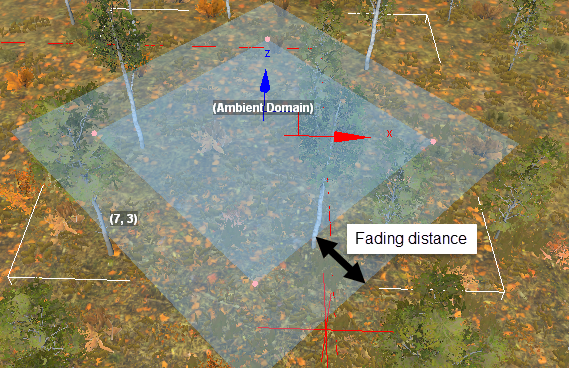

# SoundDomain Properties

Regular **SoundDomain** sets the area where a certain 2D stereo sound will play. 

For example, using this object we can configure the playback of the water lapping in the swamp.

Properties of a **SoundDomain** are the following:

-   **Name** - the internal name of the sound domain in the Editor.

-   **Sound file** - the looped stereo sound that this domain will play. For domains, this field works the same way as for [regular sounds][adding_sounds].

-   **Overlay** - the weight of the sound of this domain (from `0` to `1`). The sound of the domain will be mixed with the main ambient sound of the scene with this weight.

-   **Volume** - the playback volume. The default value is `1` (the maximum, initial volume of the sound file). If you specify values in the `[0,1]` interval, the volume of the sound file will be multiplied by this parameter (and the sound will be decreased correspondingly).

-   **Fading distance** - the distance (in meters) from the domain border where the sound will fade smoothly from its maximum volume (at the domain border) to zero (at the fading distance). On the map, this area of the fading sound is displayed as the semi-transparent external area around the domain:

    

-   **Conditions** - if this parameter is not specified (the field is empty), the sound will play at any time, during day or night. However, you can limit the interval during which it can be played:

    -   If you want to play your sound only during the day, then you should set this parameter to `DAY_FOREST, DAY_WIND`  
        Please note that these two comma-separated IDs are the single value of this parameter, not the two values. They cannot be used separately.

    -   If you want to play your sound only during the night, then you should set this parameter to `NIGHT_FOREST, NIGHT_WIND`  
        These two comma-separated IDs are also the single value of this parameter and cannot be used separately.

