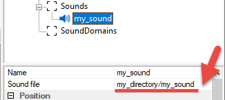

# Custom Sound Files

When configuring a [sound actor](./adding_sounds.md) or a [sound domain](./../sound_domains/adding_sound_domains.md), you can use custom sound files.

## Format
The format of custom sound files must be the following:

-   `44.1` kHz
-   `16 bit`
-   `.wav` as a storage format

Whether it is `Mono` or `Stereo` – depends on the purpose of the sound.

**WARNING**: For custom sounds, `16 bit` is a strict limitation. I.e., you will ***not*** be able to use, for example, `32-bit` sounds for your map. However, the limitation of `44.1 kHz` is a soft one (e.g., we have the `22-kHz` sounds in the game also).

## Process
To use a custom sound file, do the following:

1.  In the `Media` folder, create the `sounds` directory. This will be the root folder for all your custom sound files.  
    For example, the full path to this folder may be similar to the following:

    -   For *Expeditions*: `C:\Users\<username>\Documents\My Games\Expeditions\Media\sounds\`
    -   For *SnowRunner*: `C:\Users\<username>\Documents\My Games\SnowRunner\Media\sounds\`

2.  *Optional*: You can create subfolders there to group some of your sound files. Names of these folders must not contain spaces, they can contain Latin characters, digits, and underscores.  
    For example, you can create the `Media\sounds\my_directory` folder there.

3.  Put your custom sound files in these folders, in the `.wav` format.  
    For example, you can add `Media\sounds\my_sound.wav` or `Media\sounds\my_directory\my_sound.wav`

4.  In the **Sound file** parameter of the properties of a sound actor or a sound domain, specify the path to the sound file, including its name without the file extension. The path must be specified relative to the `Media\sounds` directory, with `/` as path delimiters and *without the file extension*.  
    For example: `my_sound` OR `my_directory/my_sound`

    

5.  When you pack your map, custom sound files will be added to the `.pak` file.

**TIP**: Along with standalone custom sounds, you can also add and use custom [*series* of sounds](./series_of_sounds.md). They are added similarly.

