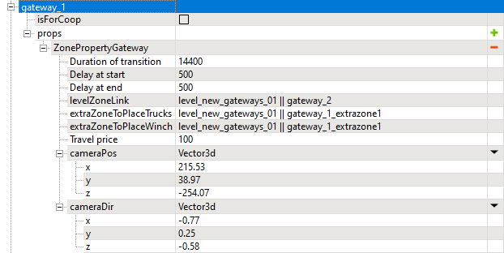

# Gateway zones

*This topic is valid for SnowRunner only.*  
*For Gateway zones in Expeditions, see [Gateway zones](./../expeditions_zones/gateway_zones.md).*

**NOTE**: In *SnowRunner*, starting with *DLC 10* (*"Season 10: Fix & Connect"*), using Gateway zones you can link not only two different maps of the same region, but two different areas *within the same map*. This section describes this scenario. For the description of the initial scenario where Gateways are placed on different maps within a Region to connect them, please refer to the [Regions with Multiple Maps][regions_with_multiple_maps] chapter and [Settings of Gateway zone][settings_of_gateway_zone] and [Gateway Rules. Extra zone][gateway_rules_extra_zone] particularly.

Gateway zones placed on the same map have almost the same mechanics of operation:

-   You need to link two Gateway zones to each other.

-   The player enters one of these zones and is spawned on the other one.

-   You need to set up camera direction and position for each gateway to make visuals of the gateway transition look good.

-   For every gateway, you need to set up an extra zone that will be used for gateway transitions if the dimensions of the initial zone of the gateway are insufficient (for long trucks, trailers, and trucks on a winch).

-   Gateway zones and extra zones should not have any obstacles (trees, rocks, etc.) within them.

However, there are some differences:

-   When you are creating Gateway zones on the same map, you need to create them ***not*** in the **Regions** tab of the Region settings window ( on the toolbar), but in the regular **Zone Settings** window ( on the toolbar), where you specify settings for all other zones of the individual map.

-   In this case, obviously, the **levelZoneLink** zone will be a link to another Gateway zone *on the same map*.

-   There is an additional field in the Gateway properties – **Travel price** – which allows you to specify the additional cost of the gateway transition for the player, see below. This field is available *only* for Gateways located on the same map.

The properties of a Gateway zone in this scenario are *almost* the same relative to the "*Gateways for connecting maps within a region*" ([Regions with Multiple Maps][regions_with_multiple_maps]) case:

-   **Duration of transition** - The duration of the gateway animation sequence, in milliseconds.

-   **Delay at start** – the delay before the playback of the gateway animation, in milliseconds.

-   **Delay at end** – the delay after the playback of the gateway animation, in milliseconds.

-   **levelZoneLink** - the target Gateway zone to which the player will be transferred. You can specify the link to this zone by clicking the  button in this field and selecting the zone from the list.
    
    **NOTE**: If you are creating Gateways for on-the-same-map transition (i.e. from the **Zone Settings** window, *not* from the **Regions** tab of the Region settings window), the list of target zones will display only zones on the same map. For instructions on setting up transitions between different maps of the Region, please refer to [Regions with Multiple Maps][regions_with_multiple_maps], [Settings of Gateway zone][settings_of_gateway_zone] and [Gateway Rules. Extra zone][gateway_rules_extra_zone] sections.

-   **extraZoneToPlaceTrucks** – the extra zone that will be used if the dimensions of the initial zone of the gateway are insufficient for the transitioned vehicles.

-   **extraZoneToPlaceWinch** – the extra zone that will be used for both the main truck and trucks or trailers that are connected to it by the winch, if the dimensions of the initial zone of the gateway are insufficient.

    **NOTE #1**: Previously, we used *two* extra zones (i.e. separate zones for **extraZoneToPlaceTrucks** and **extraZoneToPlaceWinch**) and recommended to do the same for map mods. However, now we use the one and the same extra zone for **extraZoneToPlaceTrucks** and **extraZoneToPlaceWinch** to save space necessary for the gateway setup.

    **NOTE #2**: The size of the extra zone selected in **extraZoneToPlaceTrucks** and **extraZoneToPlaceWinch** should be at least `40 x 9` and it should not have any objects in it. See [Gateway Rules. Extra zone][gateway_rules_extra_zone] for details.

-   **Travel price** – *(optional, for Gateways located on the same map only)* the price of the Gateway transition to the player. If this field is specified, the specific pop-up showing the price will appear in the UI when the player will initiate the gateway transition. If it not specified, there will be no pop-up and the transition will start directly after the initiation of the transition.
    
    **NOTE**: The "**Travel price**" mechanics work for gateways located on the same map *only*. There is no such field in settings of gateways created for connecting different maps of a Region.

-   **cameraPos** – the position of the camera at the start of the gateway animation. From this position the camera will fly to the starting point of the truck on the target zone of the gateway.

-   **cameraDir** – the direction vector for the camera at the start of the gateway animation. You should specify the direction vector here. For example: **(1, 0, 0)**.
    
    **WARNING**: If you leave the **cameraDir** field with `0` values, the gateway will not work (the player will see the black screen).
    
    **TIP**: See [Tip on cameraPos and cameraDir values][tip_on_camera] for an efficient way to specify **cameraPos** and **cameraDir** values.

[regions_with_multiple_maps]: ./../../regions/regions_with_multiple_maps.md
[settings_of_gateway_zone]: ./../../regions/settings_of_gateway_zone.md
[gateway_rules_extra_zone]: ./../../regions/gateway_rules_extra_zone.md
[tip_on_camera]: ./../../../additional_info_on_maps/camera_values/tip_on_camera_pos_and_camera_dir_values.md