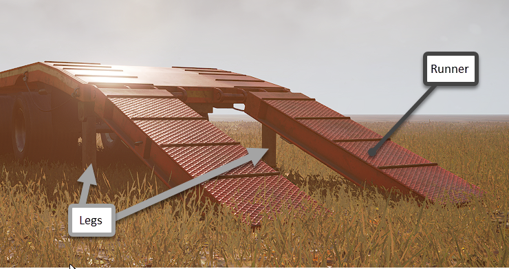
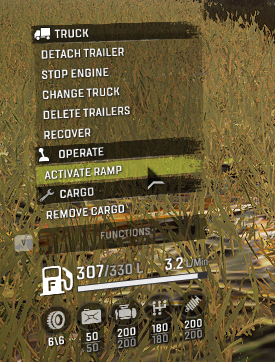
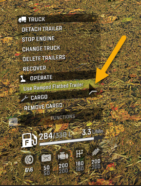

# Powered Constraints: Overview

Powered Constraints ([`<PoweredConstraints>`][poweredconstraints]) are [Constraints][physicsmodel_constraint] that can be activated by the player to reach a certain *position*. And, after deactivation, return to the initial position. 

Powered Constraints can be used in the XML classes of Addons and, for SnowRunner, Trailers. They are *not* used for Trucks themselves.

**NOTE**: The theme of Powered Constraints is rather complex and full of nuances. Below is the introductory info on this topic.

## Main Principle
The main principle of their operation is the following:

1.  Either the player or the game has some trigger for the activation of the Powered Constraint:
    -   In case of the Player, this trigger is an `Action` – some button that the player needs to press.
    -   In case of the game, this trigger lies in the internal game logic. For example, the game has some internal code that tells it to automatically activate Powered Constraints' `<Group>` with the `Id` equal to `_trailer_foot` when a trailer is attached.

2.  After its activation, a Powered Constraint will try to reach the particular *position*, using [Motor(s)][motor] of the corresponding [Constraint(s)][physicsmodel_constraint] it is based on. 
  
    **NOTE**: All Powered Constraints are based on [Constraints][physicsmodel_constraint] with [Motors][motor] of the `Position` type.

3.  When a Powered Constraint is deactivated (again, either by the same `Action` or by internal code) – it tries to return to its initial position.

As you can see, this is rather close to the mechanics of Controlled Constraints.

However, in the case of a Controlled Constraint, the player *controls* the position of the constraint by pressing either one or the other from the *pair of buttons*, but, in the case of a Powered Constraint, the player only *activates* and *deactivates* the corresponding constraint(s) using the *same button*.

## Main Aspects of Setup in XML

### Step 1: Set Up the Constraints Themselves
First of all, in the XML class of a trailer or an addon, within its [`<PhysicsModel>`][physicsmodel], you need to set up the [`<Constraint>`][physicsmodel_constraint] itself that you want the player/game to activate. This is done in a regular way.

And, in the [`<Motor>`][motor] child tag of this Constraint, you need to specify that this will be a Controlled/Powered Constraint, by setting `"Position"` as the value of its `Type` attribute. 

If you want multiple Constaints to be activated by the player/game, you need to set up all of them.

**NOTE**: You need to pay attention to the values of `Name` attributes you have specified for these constraints, since you will need them in Step 2.

For example, in SnowRunner, we have the *Ramped Flatbed Trailer* (its XML class is `[media]\classes\trucks\trailers\trailer_flatbed_ramps_4.xml` in SnowRunner's `initial.pak`) with a ramp that can be lifted or lowered and legs that are lowered when the ramp goes down. 



Its [`<PhysicsModel>`][physicsmodel] has the corresponding constraints:

```xml

		<Body
			ImpactType="Truck"
			Mass="700"
			NetSync="pv"
			ParentFrame="BoneCargo_1_cdt"
		>

			<Body
				Mass="50"
				ModelFrame="BoneLegLeft_cdt"
				NoFoliageCollisions="true"
			>
				<Constraint
					AxisLocal="(0; 0; -1)"
					Name="Leg"
					Type="Hinge"
					MinLimit="0"
					MaxLimit="100"
				>
					<Motor Force="45000" Type="Position" />
				</Constraint>
                ...
			</Body>

			<Body
				Mass="50"
				ModelFrame="BoneLegRight_cdt"
				NoFoliageCollisions="true"
			>
				<Constraint
					AxisLocal="(0; 0; -1)"
					Name="Leg"
					Type="Hinge"
					MinLimit="0"
					MaxLimit="100"
				>
					<Motor Force="45000" Type="Position" />
				</Constraint>
				...
			</Body>

                        ...
			<Body
				Friction="2.0"
				Mass="200"
				ModelFrame="BoneRamp_cdt"
				NetSync="pv"
				NoFoliageCollisions="true"
			>
				<Constraint
					AxisLocal="(0; 0; 1)"
					Name="Runner"
					Type="Hinge"
					MinLimit="0"
					MaxLimit="180"
				>
					<Motor
						Damping="1.0"
						Force="9000"
						Tau="0.04"
						Type="Position"
					/>
				</Constraint>
			</Body>
            ...
		</Body>
```
**NOTE 1**: As you have noticed, there are two constraints named `Leg` – one per each leg. And, one constraint named `Runner` – for the ramp.

**NOTE 2**: For details on tags and attributes used above, see the corresponding tags in **Tags and Attributes of Trucks**.

### Step 2: Add Groups of Powered Constraints Tied to Created Constraints 
Now, you need to create the [`<PoweredConstraints>`][poweredconstraints] section in the same XML file and add there data describing constraints that were created in Step 1 as Powered Constraints.

To do this, within this section, you will need to create a certain number of groups ([`<Group>`][group]) of Powered Constraints that will contain the *records of powered constraints* (also the `<Constraint>` tag, but a *different* one, see the note below).

**NOTE**: The [`<Constraint>`][group_constraint] tag within the [`<Group>`][group] of [`<PoweredConstraints>`][poweredconstraints] and its attributes are different from the [`<Constraint>`][physicsmodel_constraint] tag and its attributes within the [`<PhysicsModel>`][physicsmodel]. The [`<PhysicsModel>`][physicsmodel] → [`<Constraint>`][physicsmodel_constraint] describes the constraint itself, the [`<PoweredConstraints>`][poweredconstraints] → [`<Constraint>`][group_constraint] describes the "powered" nature of it.

Importantly, the [`<PoweredConstraints>`][poweredconstraints] → [`<Constraint>`][group_constraint] records that are created within the [`<Group>`][group] tags must be linked to [`<Constraint>`][physicsmodel_constraint] tags described within the [`<PhysicsModel>`][physicsmodel]. This is done by setting the same value of the `Name` attribute for [`<PoweredConstraints>`][poweredconstraints] → [`<Constraint>`][group_constraint] and for [`<PhysicsModel>`][physicsmodel] → [`<Constraint>`][physicsmodel_constraint], i.e., they are linked by `Name`.

Along with the `Name`, for every [`<PoweredConstraints>`][poweredconstraints] → [`<Constraint>`][group_constraint], we need to specify other properties, particularly, the target `Position`.

Created records of [`<PoweredConstraints>`][poweredconstraints] → [`<Constraint>`][group_constraint] we will need to wrap by the [`<Group>`][group] tags, where the `<PoweredConstraints>` → `<Constraint>` records in every `<Group>` are activated and deactivated simultaneously.

For example, in the same `trailer_flatbed_ramps_4.xml`, this configuration is the following, since we need to activate and deactivate both 2 `Leg` constraints and 1 `Runner` constraint at the same time:

```xml
	<PoweredConstraints>
		<Group ...>
			<Constraint InitialFix="true" Name="Runner" SpeedMult="0.5" Position="110" />
			<Constraint InitialFix="true" Name="Leg" SpeedMult="0.5" Position="100" />
		</Group>
	</PoweredConstraints>
```
**NOTE 1**: For details on attributes, see description of [`<PoweredConstraints>`][poweredconstraints] → [`<Constraint>`][group_constraint] in **Tags and Attributes of Trucks**.

**NOTE 2**: The [`<Group>`][group] tags can be additionally grouped by the [`<Chain>`][chain] tags to execute these groups inside a chain one after another. This setup is typically called *Powered Constraints-based animation*. Particularly, this approach allows certain powered constraints move to reach certain positions one after another, with delays in between, if necessary. See Step 4 below for details.

However, as you can see, we have *not* displayed the attributes of the [`<Group>`][group] tag in the code piece above. See the Step 3 below for details.

### Step 3: Setting Up the Activation of Created Powered Constraints

Scenarios for the activation and deactivation of Powered Constraints may vary, see below.

#### Scenario 1: Activation of the Powered Group from Functions Menu *(SnowRunner only)*
If you look at the attributes of the [`<Group>`][group] that groups the [`<PoweredConstraints>`][poweredconstraints] → [`<Constraint>`][group_constraint] tags in the same `trailer_flatbed_ramps_4.xml` you will find the following:  

```xml
	<PoweredConstraints>
		<Group ExternalUi="true" Id="anchors_position" LocaleUid="UI_HUD_INTERATION_PANEL_ACTIVATE_ADDON">
			...
		</Group>
	</PoweredConstraints>
```
This information is used for the activation of this [`<Group>`][group] (so-called *Powered Group*). The `Id` attribute here sets the identifier of this Powered Group, the `LocaleUid` sets the localization string to be used for its activation in the UI, if necessary, and the enabled `ExternalUi` flag tells the system that the regular UI used for activation of Powered Constraints should not be used and the activation from the SnowRunner's Functions menu should be used instead (see below). 



For example, we can modify the code above, use the separate groups for every powered constraint and allow the player to activate them separately, still from the SnowRunner's Functions menu:

```xml
	<PoweredConstraints>
		<Group ExternalUi="true" Id="my_id1" LocaleUid="Activate Runner">
			<Constraint InitialFix="true" Name="Runner" SpeedMult="0.5" Position="110" />
		</Group>
		<Group ExternalUi="true" Id="my_id2" LocaleUid="Activate Legs">
			<Constraint InitialFix="true" Name="Leg" SpeedMult="0.5" Position="100" />
		</Group>
	</PoweredConstraints>
```


**NOTE**: This scenario and Powered Groups with `ExternalUi="true"` will *not* work in Expeditions. See the next scenario, with `ExternalUi="false"` values – it will work.


#### Scenario 2: Activation of the Powered Group from the Regular UI
However, let's modify the code sample above even further and use the regular UI of Powered Constraints activation instead of the SnowRunner's Functions menu. In this case, we will need to:

-   Set `ExternalUi` of the [`<Group>`][group] tags to `false`.
-   Use `Action` attributes within [`<Group>`][group] tags to assign the particular buttons to the activation/deactivation of Powered Groups.

Particularly, we can modify this code piece similarly to the following:

```xml
	<PoweredConstraints>
		<Group Action="1" ExternalUi="false" Id="my_id1" LocaleUid="Activate Runner">
			<Constraint InitialFix="true" Name="Runner" SpeedMult="0.5" Position="110" />
		</Group>
		<Group Action="2" ExternalUi="false" Id="my_id2" LocaleUid="Activate Legs">
			<Constraint InitialFix="true" Name="Leg" SpeedMult="0.5" Position="100" />
		</Group>
	</PoweredConstraints>
```
**TIP**: Values of actual buttons that correspond to `Action` values by default can be seen in [Actions. Their Mapping to Buttons](./actions_and_their_mapping_to_buttons.md).

After that, the UI scheme will be changed to the following:

In the SnowRunner's Functions menu, there will be a standard option to **Use ...** as a central entry point to operations with Powered Constraints:



And, after execution of this command, the game will open the menu with Actions that activate/deactivate all Powered Groups as we have configured:


In Expeditions, the UI scheme will be similar, but the Radial menu will be used instead of the Functions menu. Actions for activation of Power Groups will also be similar:


### Step 4 (Optional): Use Chains to Execute Multiple Powered Groups One by One

As we stated before, Powered Constraints that are in the same [`<Group>`][group] are activated simultaneously. However, sometimes you need to activate powered constraints one after another, may be with some delay between them.

To do so, you can use the [`<Chain>`][chain] tag and put the [`<Group>`][group] tags within it. The order of `<Group>` tags within `<Chain>` will correspond to the order of activation of these groups.

However, in this case and if you want to activate these constraints by some Action, [`<Group>`][group] tags will have no `Action` attributes – the `Action` and `LocaleUid` will be set up for the [`<Chain>`][chain] tag. And, we will not be able to use the `true` value for `ExternalUi` attribute within `<Chain>` also.

The identifier of the [`<Chain>`][chain] will be specified in its `Name` attribute. 

Let's modify our code piece this way:

```xml
	<PoweredConstraints>
        <Chain Action="1" LocaleUid="Activate Chain of Groups">		
			<Group Id="my_i1">
				<Constraint InitialFix="true" Name="Runner" SpeedMult="0.5" Position="110" />
			</Group>
			<Group Id="my_id2">
				<Constraint InitialFix="true" Name="Leg" SpeedMult="0.5" Position="100" />
			</Group>
        </Chain>
	</PoweredConstraints>
```
After this change, the same **Use ...** command in the SnowRunner's Functions menu will open a UI for the activation of our chain:


And, after its activation, at first – the `Runner` constraint will be activated, then - 2 `Leg` constaints will be activated, as we planned. 

If necessary, you can also add time delays before unfolding or folding constraints of the particular powered groups. This can be done using the `UnfoldingDelay` and `FoldingDelay` attributes of the [`<Group>`][group] tags.


[poweredconstraints]: ./../../tags_and_attributes_of_trucks/truck/poweredconstraints/index.md
[group]: ./../../tags_and_attributes_of_trucks/truck/poweredconstraints/group/index.md
[group_constraint]: ./../../tags_and_attributes_of_trucks/truck/poweredconstraints/group/constraint/index.md
[physicsmodel_constraint]: ./../../tags_and_attributes_of_trucks/truck/physicsmodel/body/constraint/index.md
[physicsmodel]: ./../../tags_and_attributes_of_trucks/truck/physicsmodel/index.md
[motor]: ./../../tags_and_attributes_of_trucks/truck/physicsmodel/body/constraint/motor/index.md
[chain]: ./../../tags_and_attributes_of_trucks/truck/poweredconstraints/chain/index.md

