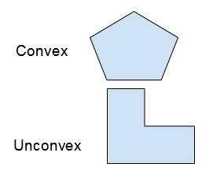

# Physical Bones and Collision Meshes

## Physical Bones
*Physical bones* are bones that are included in Havok simulation. I.e., these bones will respond to gravity, collide, have friction, and so on. 

Every physical bone *must* have at least one collision mesh. 

For convenience, we use the `NameOfBone_сdt` naming for these bones, to highlight that.

In the source file of the FBX, collision meshes are parented to their physical bones.

Physical bones along with their collision meshes allow us to form the *physical model* the truck. This physical model consits of a set of *physical bodies* and relations between them.

A *physical body* is the combination of the physical bone and the collision mesh(es) parented to it. This physical body has some physical properties and participates in physics. Physical bodies can be tied to other physical bodies by constraints between them.

The hierarchy of bones in the FBX file must be the same as the hierarchy of the physical bodies in the XML description of the physics model of the truck. This hierarchy must have only one root physical body.

However, the FBX model of the truck contains *not only* physical bones and collision meshes. Along with them, it also contains  [non-physical bones][non_physical_bones] and [visual meshes][visual_meshes].

**TIP 1**: For a simple illustration of creating physical bones in the FBX of the truck, see [Step 1: Creating 3D Model](./../../getting_started/simple_truck_mod_from_scratch/step_1_creating_3d_model.md) of the [Simple Truck Mod from Scratch](./../../getting_started/simple_truck_mod_from_scratch/overview.md) tutorial.

**TIP 2**: In XML, physical model is configured within the [`<PhysicsModel>`][physicsmodel] section. In this section, physical bodies - i.e., physical bones with their collision meshes - are described as [`<Body>`][body] tags. These physical bodies are connected to each other by constraints that are described using [`<Constraint>`][constraint] tags.

## Collision Meshes
*Collision meshes* are necessary to process collisons of physical bones and form their physical bodies. 

Names of collision meshes must begin with `cdt`. 

In general, a collision mesh can have any shape. It can be a closed figure or a two-dimensional surface.

A single physical bone can have multiple collision meshes.

From the performance point of view, the best form of the collision mesh is a cube.

It is desirable that the collision mesh is a convex figure. We recommend that due to the fact that convex-concave shapes can cause crashes. E.g., if a small collision environment object gets inside, it can "fall through" inside the collision mesh.

**TIP**: For a simple illustration of creating collision meshes in the FBX of the truck and parenting them to physical bones, see [Step 1: Creating 3D Model](./../../getting_started/simple_truck_mod_from_scratch/step_1_creating_3d_model.md) of the [Simple Truck Mod from Scratch](./../../getting_started/simple_truck_mod_from_scratch/overview.md) tutorial.

[physicsmodel]: ./../../tags_and_attributes_of_trucks/truck/physicsmodel/index.md
[body]: ./../../tags_and_attributes_of_trucks/truck/physicsmodel/body/index.md
[constraint]: ./../../tags_and_attributes_of_trucks/truck/physicsmodel/body/constraint/index.md
[visual_meshes]: ./truck_meshes.md
[non_physical_bones]: ./non_physical_bones.md