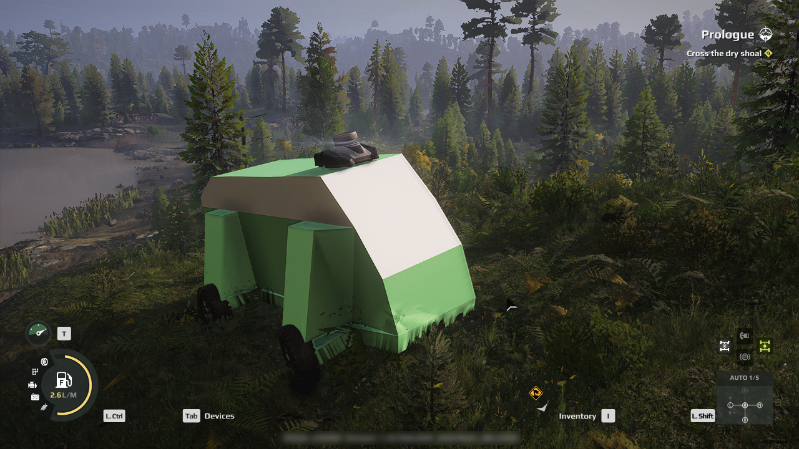

# Step 6: Testing and Publishing

## Overview
Now, its time to test your mod in the game and publish it.

The process here will be the following:

1.  [Prepare files](#prepare-files).
2.  [Load "Proving Ground"](#load-proving-ground).
3.  [Convert your mod](#convert-your-mod).
4.  [Spawn your vehicle](#spawn-your-vehicle).
5.  [Pack your mod](#pack-your-mod).
6.  [Upload your mod to mod.io](#upload-your-mod-to-modio).
7.  [Subscribe to your mod and enable it](#subscribe-to-your-mod-and-enable-it).
8.  [Test your mod in the main game](#test-your-mod-in-the-main-game).

In the list above, steps starting form Step 2 (*Load the "Proving Ground" map*) are performed the *same way* for all truck mods. 

They are described in another tutorial, here we will only link to corresponding topics, see below.

## Prepare Files
First of all, we need to ensure that all necessary files are in place.

Particularly, at this step of the tutorial, the [folder of your mod][truck_mod_folder] within `Documents\My Games\Expeditions\Media\Mods` should contain:

-   In `meshes\trucks`:
    -   The FBX file of the mod, see [Step 2][step_2].
    -   The XML file of the mesh of the mod, see [Step 4][step_4].
-   In `textures\trucks` (or simply `textures`) – The textures of the mod, see [Step 3][step_3].
-   In `classes`:
    -    In `classes\trucks` – The XML file of the class of the mod, see [Step 5][step_5] and [Step 6][step_6].
    -    In `classes\engines` – The XML file of engine classes, see [Step 6][step_6].
    -    In `classes\gearboxes` – The XML file of gear box classes, see [Step 6][step_6].
    -    In `classes\suspensions` – The XML file of suspension classes, see [Step 6][step_6].
    -    In `classes\winches` – The XML file of winch classes, see [Step 6][step_6].

**TIP**: If necessary, you can find the sample source files for this tutorial at its [next step](./step_8_source_files_and_further_exploration.md).

## Load "Proving Ground"
After checking the files, you can load the special "Proving Ground" map and test your mod there.

Moreover, this map is necessary for performing mod operations that we will need: conversion of resources and packing.

For instructions on opening the "Proving Ground" map, see [Opening the Proving Ground][opening_proving_ground].

## Convert Your Mod
First of all, you can check that the system has found your mod:

1.  In the **TOOLS** menu, select **Mod manager**.
2.  In the appearing dialog, in the **Available trucks** list, you will see the list of truck mods found by the system. 
3.  If all is good with your files, your mod will be in this list with the *Not converted* status.

Now, you can convert it. For instructions, see [Conversion of Resources][conversion_of_resources].

## Spawn Your Vehicle
Once you have converted your mod, you can spawn its instance on the "Proving Ground" map.

For instructions, see [Spawning Mod Vehicle][spawning_mod_vehicle].

**NOTE**: However, at this stage, your mod can be spawned on the "Proving Ground" map *only*. To make it available in the main game, you will need to pack your mod, upload it mod.io, and, then, download and enable it.

## Pack Your Mod
Once you have converted and tested your mod on the "Proving Ground" map, you can pack it. 

This will generate the set of `.zip` files that you can upload to mod.io.

For instructions on packing and the location of these `.zip` files, see [Packing Vehicle Mod][packing_vehicle_mod].

If some errors occur during validation or packing, you can view log records of these errors. See [Viewing Error Log][viewing_error_log].

## Upload Your Mod to mod.io
After packing, you can upload your mod to mod.io. 

This is necessary for making this mod available in the *main game* – i.e., not only on the "Proving Ground" map.

For instructions on uploading, see [Uploading Mod to mod.io][uploading_mod_to_mod_io].

## Subscribe to Your Mod and Enable It
After uploading your mod to mod.io, you need to *Subscribe* to it and *Enable* it.

For instructions on this, see [Enabling Mod in the Game][enabling_mod_in_the_game].

This will make your mod available in the main game.

## Test Your Mod in the Main Game
After enabling your mod, you can test it in the main game.

Now, if you open the game, you will see your mod in the **Truck Store** and will be able to purchase it when preparing for an Expedition.

After that, finally, you will be able to test it on one of the game maps:

**Congratulations on creating your first mod!**

During testing, you will for sure find issues that need to be fixed, it is a normal process. All mods are borned dirty and are polished later, and our sample mod is not an exception.

[truck_mod_folder]: ./step_0_prerequisites.md#mod-folder
[step_2]: ./step_2_exporting_to_fbx.md
[step_3]: ./step_3_creating_textures.md
[step_4]: ./step_4_creating_xml_file_of_truck_mesh.md 
[step_5]: ./step_5_creating_xml_file_of_truck_class.md
[step_6]: ./step_6_creating_xml_files_of_truck_components.md
[registration_and_authentication]: ./../../../usage_and_uploading_of_mods/2___registration_and__authentication.md
[upload]: ./../../../usage_and_uploading_of_mods/4_3___uploading__files_of_the__mod.md

[opening_proving_ground]: ./../sample_mod_by_the_game/opening_the_proving_ground.md
[conversion_of_resources]: ./../sample_mod_by_the_game/conversion_of_resources.md
[spawning_mod_vehicle]: ./../sample_mod_by_the_game/spawning_mod_vehicle.md
[packing_vehicle_mod]: ./../sample_mod_by_the_game/packing_vehicle_mod.md
[viewing_error_log]: ./../sample_mod_by_the_game/viewing_error_log.md
[uploading_mod_to_mod_io]: ./../sample_mod_by_the_game/uploading_mod_to_mod_io.md
[enabling_mod_in_the_game]: ./../sample_mod_by_the_game/enabling_mod_in_the_game.md