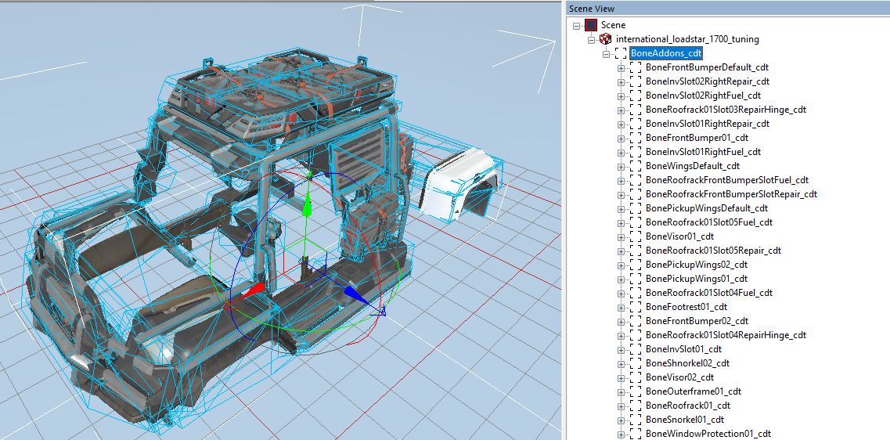
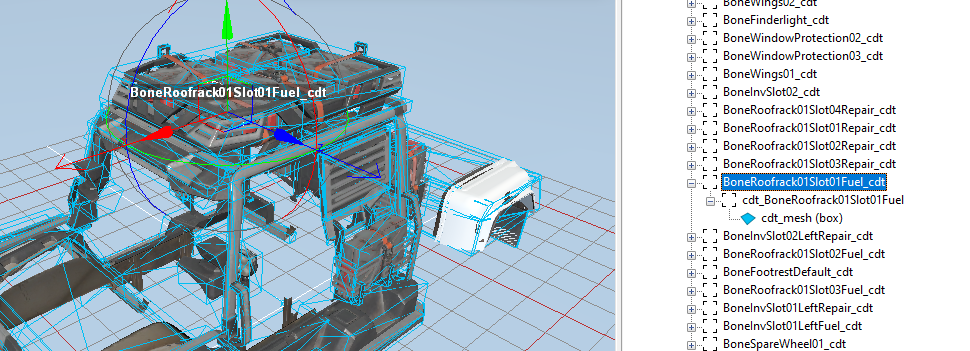
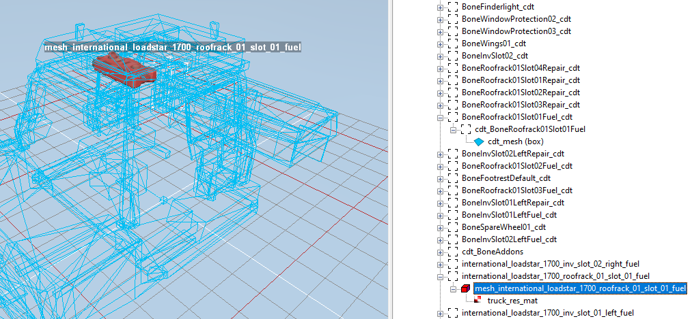

# Addon Changes
*(NEW) Changes described in this topic are valid for Expeditions only.*

Modding of addons has some important changes in Expeditions, see below.


## One FBX, One Root Bone
In Expeditions, we can create a single FBX file for all visual addons to the truck. Or, for a particular group of such addons. For example, you can create two FBXes: one for regular addons, and one for Consumables. Or, add all addons for a particular part of the truck to a single FBX.

Inside this FBX, we need to create a single root bone for all addons in this FBX (e.g. `BoneAddons_cdt`).



**NOTE**: Since this root bone of all addons in the FBX (e.g. `BoneAddons_cdt`) is physical, it must have a (conventional and simplified) collision mesh. For example, we can model a small cube inside the truck for this purpose. 

**WARNING**: The name of the separate *visual mesh* of the particular addon in the FBX must be different from the name of the *XML class of this addon*. If these two names are the same, the addon will not work. Due to this, we recommend using the `viz_` prefixes in names of visual meshes of addons in the FBX. 

However, the old scheme from SnowRunner – a separate FBX for every addon – is also supported. 


## Still a Separate XML Class of Addon
However, to describe an addon from the created multi-addon FBX, you still need to create an individual XML class file of this addon, which will contain its physical model (see below) and other properties.


## Physical Model: Multiple Schemes and Link to Visual Mesh
There are several schemes of creating the physical model of the addon, see subsections below.

Along with that, in *Expeditions*, the physical model may contain the link to the *visual mesh of the particular addon*. This can be necessary, since we need to single out this visual mesh from the FBX that now contains multiple addons. Particularly, this mesh may be referenced in the `MeshFrame` attribute of the `<PhysicsModel>` tag, see below.

### Scheme 1: Root Bone of Addons with Rigid constraint and Other Bones Below It
In the physical model of the addon, the root bone (e.g. `BoneAddons_cdt`) and the corresponding physical `<Body>` will have a `Rigid` constraint, which will fix it on the truck. All other physical bodies of the addon can be attached to this root bone with necessary constraints. Consumables can be attached similarly.

For example:
```xml
		<Body Collisions="None" Mass="1" ModelFrame="BoneAddons_cdt">
			<Constraint Type="Rigid"/>
			<Body 
            	Collisions="None"
                Mass="20"
                ModelFrame="BoneRoofrack01Slot01Fuel_сdt">
			<Constraint
				Type="Fixed"
				LinearLimitsX="(-0.015;0.01)"
				LinearLimitsY="(-0.008;0.008)"
				LinearLimitsZ="(-0.003;0.0065)"
			/>
			</Body>
		</Body>
```
The created physical model need to be created as usual. However, you need to describe in it only physical bones and collision meshes that are related to this particular addon. The visual *mesh of this particlar addon* (which will be the part of the FBX) needs to be referenced in the `MeshFrame` attribute of the `<PhysicsModel>` tag.

For example:
```xml
	<PhysicsModel Mesh="trucks/tuning/mytruck_tuning" MeshFrame="viz_mytruck_roofrack_01_slot_01_fuel">
		<Body Collisions="None" Mass="1" ModelFrame="BoneAddons_cdt">
			<Constraint Type="Rigid"/>
			...
		</Body>
	</PhysicsModel>
```
**WARNING**: The name of the visual mesh of the addon that is specified in the `MeshFrame` attribute must be different from the name of the XML class of the addon. See [above](#one-fbx-one-root-bone).

If the `MeshFrame` attribute is omitted, the whole FBX (from the `Mesh` attribute) will be considered as a visual mesh of the addon.

*Physical body of an addon in the FBX:*  


*Visual mesh of the addon in the FBX:*


**NOTE**: For original game trucks, one of which is shown on the screenshot above, the `viz_` prefixes in names of visual meshes are not used. However, they are recommended for truck mods to avoid the issue with the same names or the visual mesh of the addon and its XML class, see [above](#one-fbx-one-root-bone).

The scheme described above is valid for addons that are tied to the truck *nonrigidly* and, also, for [consumables](./consumables.md). 

### Scheme 2: Bone of the Addon Itself with Rigid Constraint
For *rigidly* tied addons – e.g., various bumpers – you need to use a different scheme. 

Particularly, as the root bone in the physical model in this case you need to specify the physical bone of the addon itself – e.g., the bone of the bumper. And, you need to tie it to the truck with the `Rigid` contraint, not the `Fixed` one.

For example:

```xml
	<PhysicsModel Mesh="trucks/tuning/mytruck_tuning" MeshFrame="mytruck_front_bumper_02">
		<Body ImpactType="Truck" Mass="60" ModelFrame="BoneFrontBumper02_cdt">
			<Constraint Type="Rigid" />
		</Body>
	</PhysicsModel>
```  

**NOTE**: The visual *mesh of this particlar addon* (which will be the part of the FBX) still needs to be referenced in the `MeshFrame` attribute of the `<PhysicsModel>` tag.

### Scheme 3: Root Bone of the Addon Itself with Non-Rigid Constraint
However, if necessary, we can also make the physical bone of the addon itself the root bone of the physical model and attach it directly to the truck *by the non-rigid constraint* (e.g., by `Fixed` constraint).

For example:
```xml
	<PhysicsModel AcceptVisualDamage="false" Mesh="trucks/tuning/mod_scout_tuning" MeshFrame="viz_mod_scout_roofrack_01_slot_01_fuel">
		<Body Collisions="None" Mass="20" ModelFrame="BoneRoofrackSlot01_cdt">
			<Constraint
				LinearLimitsX="(-0.003;0.001)"
				LinearLimitsY="(0;0)"
				LinearLimitsZ="(-0.004;0.006)"
				Type="Fixed"
			/>
		</Body>
	</PhysicsModel>
```

**NOTE 1**: The code above describes the physical model of a [Consumable](./consumables.md) addon and this addon does not stick out significantly from the roof rack. So, we have disabled collisions for it – i.e., have set `Collisions="None"`.

**NOTE 2**: The visual *mesh of this particlar addon* (which will be the part of the FBX) still needs to be referenced in the `MeshFrame` attribute of the `<PhysicsModel>` tag.


## Ability to Disable Visual Damage
The `<PhysicsModel>` tag is now containing the optional `AcceptVisualDamage` attribute that you can set to `false` to disable a visual damage to the addon:

```xml
	<PhysicsModel AcceptVisualDamage="false" Mesh="trucks/tuning/mytruck_tuning" MeshFrame="viz_mytruck_roofrack_01_slot_01_fuel">
		...
	</PhysicsModel>
```


## Ability to Set up Required Suspension for Addon
Since [Truck Replacements](./truck_replacements.md) are now available, there is an option to tie an addon to the particular suspension. 

This can be done by adding the `RequiredSuspension` tag to `<GameData>` in addon XML class and specifying compatible suspensions in the `Types` attribute:

```xml
	<GameData ...>
		...
		<RequiredSuspension Types="don_71_suspension_crawler, don_71_suspension_high" />
		...
	</GameData>
```

In some cases, this can be absolutely necessary, since some Truck Replacements can modify the visual mesh of the truck or some of its parts and their installation may result in "clipping" of the addon.


## Ability to Set up Groups of Required Addons
Now you can create groups of required addons that will require the player to pre-install one of the listed addons – i.e. specify the logical `OR` condition for necessary addons. This can be done in the XML class of the addon, by specifying these addons in the `Types` attribute of the `<RequiredAddon>` tag as a comma separated list.

And, you can combine these groups by the logical `AND` condition by usage of multiple `<RequiredAddon>` tags.  

For example, you can describe the outerframe addon to `don_71` that requires either `don_71_front_bumper_01` or `don_71_front_bumper_02` and either `don_71_rear_bumper_01` or `don_71_rear_bumper_02` and either `don_71_wings_01` or `don_71_wings_02` the following way:

```xml
	<GameData ...>
        ...
		<RequiredAddon Types="don_71_front_bumper_01, don_71_front_bumper_02" />
		<RequiredAddon Types="don_71_rear_bumper_01, don_71_rear_bumper_02" />
		<RequiredAddon Types="don_71_wings_01, don_71_wings_02" />
        ...
	</GameData>
```

I.e., the piece of code above can be read as the following requirement:

```text
		"don_71_front_bumper_01" OR "don_71_front_bumper_02"
        AND
		"don_71_rear_bumper_01" OR "don_71_rear_bumper_02"
		AND
        "don_71_wings_01" OR "don_71_wings_02"
```


## Consumables as Special Type of Addons 
*Consumable* items can be created as addons with specific characteristics that require other addons for their installation on the truck. 

Whether or not the addon is a consumable is defined by the value of its `IsConsumable` attribute within [`<GameData>`](./../tags_and_attributes_of_trucks/truckaddon/gamedata/index.md) in the XML class of this addon (consumable). 

And, all consumables are installed *not* to the truck directly, but to another addon that should be set up as a required for this consumable, using the [`<RequiredAddon>`](./../tags_and_attributes_of_trucks/truckaddon/gamedata/requiredaddon/index.md) tag. This should be set up in the XML class of the consumable, more precisely – in the XML class of the *addon that is defined as this consumable* (see above).

Particularly, the setup for consumables and regular addons in this aspect is the following:

| Type          | `IsConsumable` attribute     | `<RequiredAddon>` tag     | 
|---------------|------------------------------|---------------------------|
| Regular Addon | `false`                      | *(Optional)*              |
| Consumable    | `true`                       | *(Mandatory)*             |

Consumables are added to the truck when the player selects them in the particular slot in "Resource Slots" of the truck, after installation of the addon required for these consumables. See [Consumables](./consumables.md) for details.


## Installation of Addons
An addon to the truck is still intalled into particular [`<Socket>`](./../tags_and_attributes_of_trucks/truck/gamedata/addonsockets/socket/index.md) within the [`<AddonSockets>`](./../tags_and_attributes_of_trucks/truck/gamedata/addonsockets/index.md) tag. This info is specified in the XML class of the truck.

```xml
		<AddonSockets DefaultAddon="don_71_front_bumper_default">
			<Socket Names="Don71FrontBumper" ParentFrame="BoneCabin_cdt" />
		</AddonSockets>
```
And, the XML class of the *addon* still stores the information of the socket that is compatible for it within the [`<InstallSocket>`](./../tags_and_attributes_of_trucks/truckaddon/gamedata/installsocket/index.md) tag of [`<GameData>`](./../tags_and_attributes_of_trucks/truckaddon/gamedata/index.md). 

```xml
		<InstallSocket Type="Don71FrontBumper" />
```

However, now, using the [`<RequiredAddon>`](./../tags_and_attributes_of_trucks/truckaddon/gamedata/requiredaddon/index.md) tag, you can (require to) install an addon or a [consumable](./consumables.md) only to another installed addon. 

For example, you can create a roof rack as an addon that will have a certain number slots for consumables and leave the particular selection of these consumables to the player. And these slots of consumbales will be available only if this addon is installed. See [Consumables](./consumables.md) for details.


## Frame Modules and Frame Addons for Hosting Them
*Frame modules* are addons of a special type that can be installed on top of the other frame addons. The latter frame addons need to be specifically set up to allow such hosting. 

For example, a Radar can be installed on top of the Short Flatbed. Or, a regular Flatbed, which is twice larger than a short one, can host either a Fuel Tank and a Small Kung, or the regular Kung.

Unlike SnowRunner, Expeditions is not focused on Cargo delivery. But, inside the XMLs, frame modules and frame addons for hosting them are described similiraly to Cargo Addons (i.e. Cargo in its packed state when it is already loaded to a truck) from SnowRunner and frame addons or trailers that can host these Cargo Addons.

Particularly, in the XML class of the *frame addon for hosting frame modules*, you need to configure the [`<AddonSlots>`](./../tags_and_attributes_of_trucks/truckaddon/gamedata/addonslots/index.md) tag that will describe the [*slots*](./../tags_and_attributes_of_trucks/truckaddon/gamedata/addonslots/index.md) where these frame modules can be installed to, as if you were decribing slots for loading Cargo.

```xml
	<GameData ...>
		...
		<AddonSlots
			InitialOffset="(-0.2; 0.49; 0)"
			OffsetStep="(-2.7; 0; 0)"
			Quantity="2"
		/>
	</GameData>
```
In the XML class of the *frame module*, you need to configure the [`<InstallSlot>`](./../tags_and_attributes_of_trucks/truckaddon/gamedata/installslot/index.md) tag that will describe this frame module as something that can be installed to the described slots (and will occupy a certain number of them), as if you were describing a Cargo Addon. 

```xml
	<GameData ...>
		...	
		<InstallSlot 
			CargoLength="1"
			CargoType="Addon"
			Offset="(0; 0; 0)"
		/>
	</GameData>	
```

And, in the XML class of the *frame module*, within the [`<GameData>`](./../tags_and_attributes_of_trucks/truckaddon/gamedata/index.md) tag, you also need to set `Subcategory` attibute to `module` value to display this frame module in the customization UI.

Along with that, regardless of the fact that this is a frame module, which is attached to the frame addon (*not* to the truck directly), you still need to provide in the XML class of the *frame module* configuration based on the [`<InstallSocket>`](./../tags_and_attributes_of_trucks/truckaddon/gamedata/installsocket/index.md) and [`<RequiredAddon>`](./../tags_and_attributes_of_trucks/truckaddon/gamedata/requiredaddon/index.md) tags, which were discussed [before](#installation-of-addons), as if you were attaching this frame module to the truck. 

However, this is necessary for legacy reasons *only* and should be done in the XML class of the frame module *only*. I.e., unlike the setup of a regular addon, in this case, there is no necessity to add the matching [`<Socket>`](./../tags_and_attributes_of_trucks/truck/gamedata/addonsockets/socket/index.md) tag to the XML class of the *truck*. 

For example, as a result, the [`<GameData>`](./../tags_and_attributes_of_trucks/truckaddon/gamedata/index.md) tag within the XML class of the *frame module* will be looking similarly to the following:

```xml
	<GameData
		...
		Category="frame_addons"
		Subcategory="module"
        ...
	>
        ...
		<InstallSocket Offset="(0; 0; 0)" Type="FrameModule" />
		<RequiredAddon Types="frame_module_flatbed, frame_module_flatbed_short" />
		<InstallSlot 
			CargoLength="1"
			CargoType="Addon"
			Offset="(0; 0; 0)"
		/>
	</GameData>	
```

And the corresponding XML class of the *truck* will *not* have the `<Socket>` tag with the matching `Names="FrameModule"` value, since all info on the attachment of this frame module will be read from the XML class of the *frame addon for hosting frame modules* – see the code block with the [`<AddonSlots>`](./../tags_and_attributes_of_trucks/truckaddon/gamedata/addonslots/index.md) tag above.
