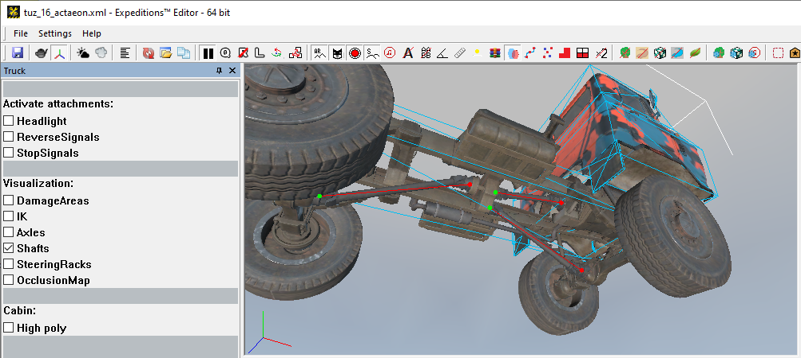

# Shaft

The `<Shaft>` tag describes a particular shaft of the truck.

*Configured shafts of the truck can be visualized in the Editor:*  

Shafts of the trucks do not belong to a particular truck. I.e., one mesh and one setup of the shaft are common for all vehicles. To be more precise, currently we have two setups: `env/shaft` for trucks and `env/minishaft` for scouts.

Only points from where the shaft begins and where it ends are set within the truck itself.

The bones of the shaft are automatically attached to the bones of the physical model, basing on the weights of the nearest vertex on the truck mesh.

Attributes:

-   `SocketPointA="ShaftA1"`  
    *(Mandatory.)* The name of the [`<SocketPoint>`][socketpoint] socket, which is specified in the XML of the Mesh of the truck (e.g., `<SocketPoint Name="ShaftA1" />`) or the transfer case addon.

-   `SocketPointB="ShaftB1"`  
    *(Mandatory.)* The name of the [`<SocketPoint>`][socketpoint] socket, which is specified in the XML of the Mesh of the truck (e.g., `<SocketPoint Name="ShaftB1" />`) or the transfer case addon.

-   `Mesh="env/example_shaft"`  
    The path to the `.../meshes/env/example_shaft.fbx` FBX file of the shaft. Default value: `"env/shaft"`.

-   `PointAConnectedToAddon="true"`  
    This attribute needs to be `true`, if the socket is described in the XML of the Mesh of the transfer case addon. By default: `false`.

-   `PointBConnectedToAddon="true"`  
    This attribute needs to be `true`, if the socket is described in the XML of the Mesh of the transfer case addon. By default: `false`.

[socketpoint]: ./../../../../combinexmesh/socketpoints/socketpoint/index.md